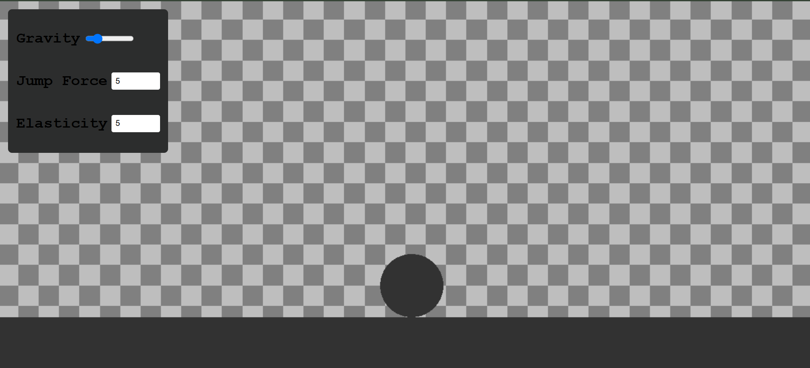

# Physics Game

This is a really great and my first ever project made with KAPLAY.js. idk how, but this took so much time for me to build it, cause first I came to know the basics of this library, then became used to it, and then made some cool features!

## Live Demo

This project is hosted on github pages and can be accessed from here: https://github.com/Rishaan2202/physics-game

## Development

If you want to make changes to this project, the follow the following steps:

```sh
$ npm clone https://github.com/Rishaan2202/physics-game.git
```

Clone the Repository to your editor

```sh
$ npm run dev
```

Will start a dev server at http://localhost:8000

## Features

- Custom Gravity
- Custom Elasticity
- Custom Jump Force

## Insights


